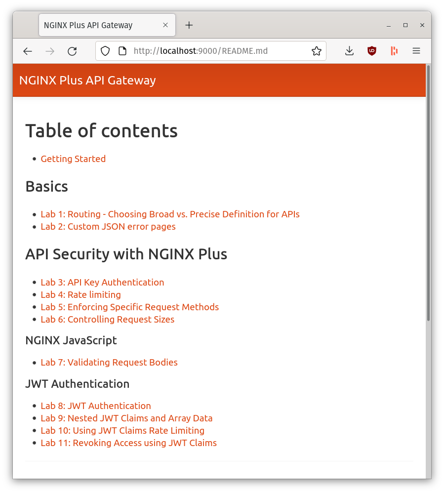
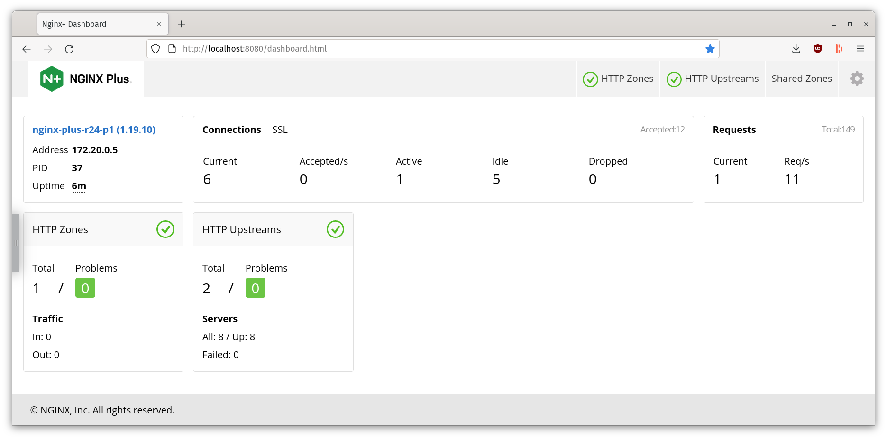
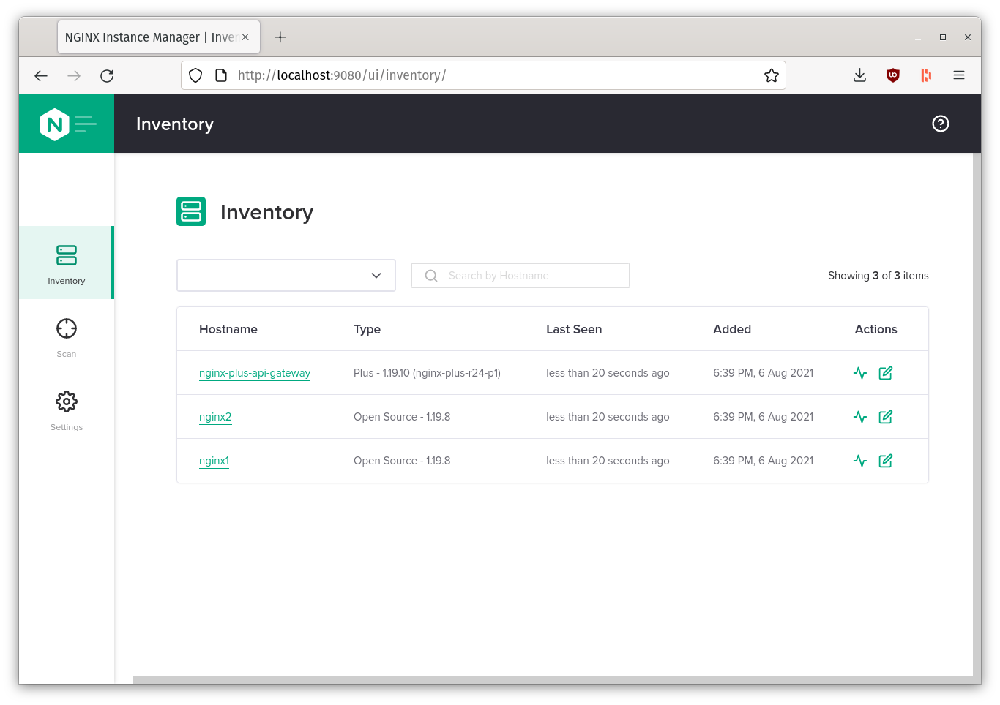
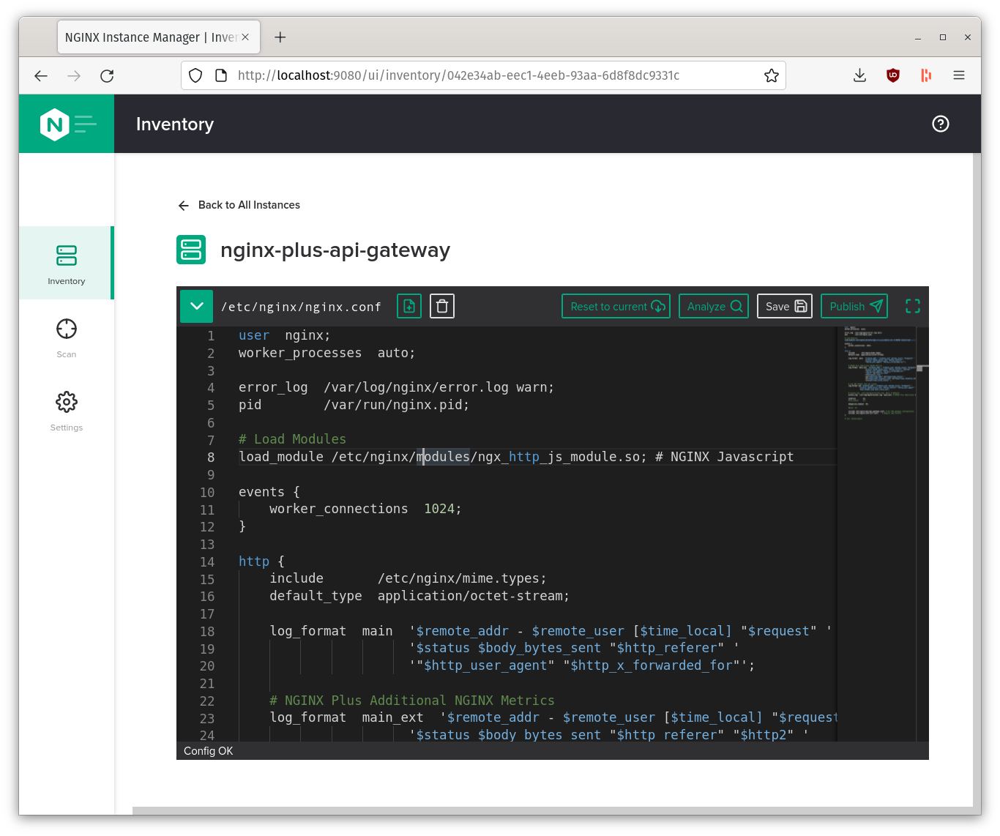

# Demo setup

Open two terminals: One to view the Nginx logs in realtime, and another to run
commands for our demos

#### 1. View Nginx logs in real time

1. In one terminal, view the the NGINX Plus API Gateway logs

```bash
# by ID
$ docker logs -f [CONTAINER ID]
# Or by Name
# $ docker logs -f [CONTAINER NAME]
$ docker logs -f nginx-plus-api-gateway
```

#### 2. Enter terminal of NGINX docker container

1. In another terminal, enter a `bash` shell on the NGINX Plus API Gateway Host

```bash
# by ID
$ docker exec -i -t [CONTAINER ID] /bin/bash
# Or by Name
# $ docker exec -i -t [CONTAINER NAME] /bin/bash #by Name
$ docker exec -i -t nginx-plus-api-gateway /bin/bash
```

2. Throughout this workshop we will be using various terminal commands and some
   bash scripts to switch and load the running NGINX Configurations. One useful
   tool used throughout the workshop lab is
   [`bat`](https://github.com/sharkdp/bat). `Bat` is like the
   [`cat`](http://www.linfo.org/cat.html) command but supports syntax
   highlighting for a large number of programming and markup languages

#### 2. Open the Lab Guide

1. Open the Lab guide in a Web browser on [http://localhost:9000](http://localhost:9000)



#### 3. Open NGINX Plus Dashboard

To see real-time metrics of traffic passing through the NGINX Plus API Gateway
open the NGINX Plus Dashboard on [http://localhost:8080](http://localhost:8080)



#### 4. Open NGINX Instance Manager

In a Web Browser, open the NGINX Instance Manager on
[http://localhost:9080](http://localhost:9080)

While most of this Workshop is Command-line driven and editing the configuration
is minimal, we can still used NGINX's Instance Manager's Inventory Manager
Built-in IDE to quickly view (and edit) the NGINX configuration files in the Web
UI





[Back to Main Menu](../README.md)